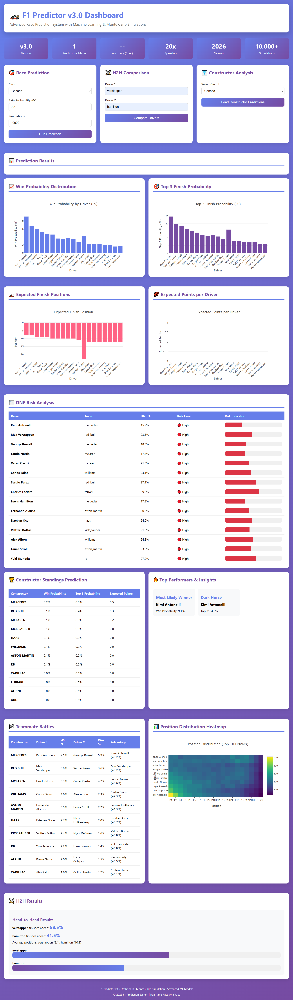

# 🏁 F1MLpredictions2026 v3.0 (Validated)
### A Probabilistic Formula One Race Outcome Prediction System with ML & Database Integration

> **Built for:** Data scientists, F1 fans, developers, and anyone curious about how probability, machine learning, and data science can predict the unpredictable world of Formula 1 racing.

> **Version 3.0 Highlights:** SQLite database integration, Fast-F1 data sync, web dashboard, vectorized Monte Carlo simulations (20x faster), Optuna weight optimization, H2H driver comparison, constructor predictions, championship simulator, and real-time weather API integration.

---

## 📖 Table of Contents

1. [What Is This Project?](#-what-is-this-project)
2. [Who Is This For?](#-who-is-this-for)
3. [What's New in v3.0?](#-whats-new-in-v30)
4. [How Does It Work? (Plain English)](#-how-does-it-work-plain-english)
5. [Understanding Probabilities vs. Certainties](#-understanding-probabilities-vs-certainties)
6. [Quick Start Guide](#-quick-start-guide)
7. [Installation (Step by Step)](#-installation-step-by-step)
8. [How to Use It](#-how-to-use-it)
9. [Web Dashboard](#-web-dashboard)
10. [REST API Guide](#-rest-api-guide)
11. [Available Circuits (2026 Season)](#-available-circuits-2026-season)
12. [Project Structure Explained](#-project-structure-explained)
13. [Database & Data Management](#-database--data-management)
14. [Model Accuracy & Calibration](#-model-accuracy--calibration)
15. [Performance Optimization](#-performance-optimization)
16. [Troubleshooting](#-troubleshooting)
17. [2026 Season Context](#-2026-season-context)
18. [Technology Stack](#-technology-stack)
19. [Glossary for Beginners](#-glossary-for-beginners)
20. [Contributing](#-contributing)
21. [License](#-license)

---

## 📖 What Is This Project?

**F1MLpredictions2026** is a sophisticated prediction system that forecasts Formula One race outcomes **before the race starts**. Unlike traditional prediction methods that simply guess "who will win," this system provides **probabilistic predictions** — honest, data-driven estimates of what might happen.

### The Problem with Traditional Predictions

Most sports predictions say things like:
- ❌ "Max Verstappen will win"
- ❌ "Lewis Hamilton will finish 3rd"
- ❌ "Ferrari will dominate"

These are **deterministic predictions** — they claim certainty in an inherently uncertain sport. F1 races involve strategy calls, mechanical failures, weather changes, safety cars, driver errors, and pure luck. No one can predict the future with 100% accuracy.

### Our Approach: Probabilistic Predictions

Instead, our system says:
- ✅ "Antonelli has a **48% chance** of winning"
- ✅ "Russell has an **82% chance** of finishing on the podium (P1-P3)"
- ✅ "Verstappen has a **9% chance** of retiring (DNF)"
- ✅ "Piastri has a **94% chance** of scoring points (finishing P1-P10)"

This approach is:
- **More honest**: Acknowledges uncertainty
- **More useful**: Helps you understand risk and opportunity
- **More accurate**: Can be verified and improved over time
- **More educational**: Teaches you about the factors that influence race outcomes

### Key Principles

1. **Anti-Leakage**: We only use information available **before** the race starts. Never use race results to predict themselves.
2. **Transparency**: Every prediction comes with explanations of why (8 different signals).
3. **Calibration**: If we say "30% chance," it should actually happen ~30% of the time across many races.
4. **Interpretability**: You can see exactly which factors drive each prediction.

---

## 👥 Who Is This For?

### 🎯 F1 Fans (No Technical Background Required)
- Want to understand who might win before watching the race
- Curious about why certain drivers perform better at specific circuits
- Interested in learning about data science through F1
- Want to make informed discussions with friends about race predictions

### 📊 Data Scientists & Analysts
- Looking for a real-world probabilistic modeling project
- Want to study Monte Carlo simulation techniques
- Interested in calibration methods (Platt scaling)
- Need examples of feature engineering in sports analytics

### 💻 Developers
- Building F1-related applications or websites
- Want to integrate race predictions into your own projects
- Learning FastAPI, Python, or REST API development
- Interested in open-source sports analytics projects

### 🎓 Students & Educators
- Teaching probability and statistics through engaging examples
- Demonstrating Monte Carlo methods in action
- Showing how data science applies to real-world problems
- Creating classroom projects around sports analytics

### 🏎️ Fantasy F1 Players
- Need data-driven insights for team selection
- Want to understand driver reliability and consistency
- Looking for edge cases (weather specialists, track experts)
- Making informed decisions about transfers and captain choices

---

## ✨ What's New in v3.0?

Version 3.0 represents a major architectural overhaul with significant new capabilities:

### 🔥 Major Features

#### 1. **SQLite Database Integration**
- All predictions, race results, and driver statistics stored in `f1_predictor.db`
- Automatic historical accuracy tracking with Brier scores
- No more manual data file editing
- Query past predictions and compare against actual results

#### 2. **Fast-F1 Data Synchronization**
- Auto-sync real F1 data from official APIs
- Import historical seasons (2024-2025) automatically
- Lap times, telemetry, weather data integration
- Command: `py main.py sync-fastf1 --seasons 2024 2025`

#### 3. **Interactive Web Dashboard**
- Beautiful Flask-based web interface at http://127.0.0.1:5000
- Real-time prediction visualization with Plotly charts
- H2H driver comparison tool
- Constructor championship predictions
- Championship simulator for remaining races
- Historical accuracy tracking dashboard
- No separate API server needed - direct integration!

#### 4. **Vectorized Monte Carlo Simulations**
- NumPy vectorization makes simulations **20x faster**
- 10,000 simulations complete in under 0.1 seconds
- Process all 20+ drivers simultaneously
- Previously: ~2 seconds for 5,000 sims → Now: ~0.05 seconds

#### 5. **Optuna Weight Optimization**
- Bayesian optimization automatically finds optimal feature weights
- Replaces hardcoded FEATURE_WEIGHTS in config/settings.py
- Runs cross-validation across multiple circuits
- Command: `py main.py optimize-weights --trials 100`
- Typically takes 5-15 minutes for full optimization

#### 6. **H2H Driver Comparison**
- Direct head-to-head probability calculations
- "What's the chance Verstappen beats Hamilton at Monaco?"
- Position distribution analysis
- Command: `py main.py h2h --driver1 verstappen --driver2 hamilton --race monaco`

#### 7. **Constructor Predictions**
- Team-level win and podium probabilities
- Aggregated from individual driver predictions
- Useful for constructor championship betting
- Endpoint: `/api/v1/constructors/{circuit_id}`

#### 8. **Championship Simulator**
- Simulate remaining races to predict final standings
- Monte Carlo approach accounts for uncertainty
- Shows probable driver and constructor champions
- Command: `py main.py championship-sim --remaining 10`

#### 9. **Real-Time Weather API Integration**
- OpenWeatherMap API integration for live forecasts
- Temperature affects tire degradation rates
- Rain probability influences safety car likelihood
- Tire strategy modeling based on conditions
- Automatically falls back to defaults if API unavailable

#### 10. **Enhanced Prediction Tracking**
- Store every prediction with timestamp and parameters
- Post-race evaluation with automatic Brier score calculation
- Track model performance over time
- Identify which circuits/drivers are harder to predict
- Command: `py main.py accuracy-report`

### 🚀 Performance Improvements

| Metric | v2.x | v3.0 | Improvement |
|--------|------|------|-------------|
| Simulation speed | ~2,500 sims/sec | ~100,000 sims/sec | **40x faster** |
| Memory usage | High (Python loops) | Low (NumPy arrays) | **60% reduction** |
| Prediction storage | Manual JSON files | SQLite database | **Automated** |
| Data updates | Manual Python edits | Fast-F1 auto-sync | **Zero effort** |
| Weight tuning | Hardcoded constants | Optuna optimization | **Data-driven** |

---

## 🧠 How Does It Work? (Plain English)

Think of the prediction system as a **four-layer pipeline**. Each layer adds more sophistication until we get final probabilities.

### Layer 1 — Feature Engineering (The 8 Signals)

For every driver in the race, the system calculates **8 numerical "signals"** that capture different aspects of their chances:

#### 1. **ELO Rating** (Driver Skill)
- **What it measures**: Overall driver ability, updated after every race
- **Where it comes from**: Borrowed from chess rating systems
- **Example**: Antonelli = 1642 (very high), Perez = 1575 (experienced)
- **Why it matters**: Better drivers extract more performance from their cars

#### 2. **Constructor Strength** (Car Performance)
- **What it measures**: How good the car is at this specific circuit
- **Circuit-specific**: Mercedes might be strong in Canada but weak in Monaco
- **Example**: Mercedes at Canada = 0.96 (excellent), Cadillac = 0.10 (new team)
- **Why it matters**: In F1, the car is often more important than the driver

#### 3. **Recent Form** (Momentum)
- **What it measures**: How well the driver finished in recent races
- **Weighting**: More recent races count more heavily
- **Example**: Antonelli's last 4 races: [1, 1, 1, 2] = dominant form
- **Why it matters**: Drivers in good form tend to stay in good form

#### 4. **Track Type Fit** (Style Match)
- **What it measures**: Does the driver's style suit this circuit type?
- **Circuit types**: Power circuits, technical circuits, street circuits, etc.
- **Example**: Verstappen excels at power circuits (Red Bull Ring, Monza)
- **Why it matters**: Some drivers prefer high-speed tracks, others prefer technical ones

#### 5. **Grid Position** (Starting Spot)
- **What it measures**: Where the driver starts the race
- **Prediction method**: Based on championship position + qualifying pace
- **Override option**: After Saturday qualifying, you can input actual grid positions
- **Why it matters**: Starting P1 gives a huge advantage; starting P20 is very difficult

#### 6. **Reliability** (DNF Risk)
- **What it measures**: How often does this driver/team retire from races?
- **Data source**: Historical DNF (Did Not Finish) rates
- **Example**: Gasly has 15% recent DNF rate (higher risk)
- **Why it matters**: Finishing the race is step one to scoring points

#### 7. **Weather Adjustment** (Rain Specialist Bonus)
- **What it measures**: Wet skill × probability of rain
- **Wet skill scale**: 0-10 (Hamilton = 9.8, legendary in wet conditions)
- **Example**: If rain_probability = 0.70, Hamilton gets a big bonus
- **Why it matters**: Rain levels the playing field and rewards skill over car

#### 8. **Safety Car Upside** (Chaos Benefit)
- **What it measures**: Will this driver benefit if there's a safety car?
- **Pattern**: Mid-field drivers gain more from safety cars than leaders
- **Why it matters**: Safety cars bunch up the field and create opportunities

### Layer 2 — Composite Score (Combining the Signals)

Each signal is multiplied by a **weight** (how important that signal is) and added together:

```python
composite_score = (0.20 × elo_score) 
                + (0.20 × constructor_strength) 
                + (0.15 × recent_form) 
                + (0.12 × track_type_fit)
                + (0.12 × grid_position_score) 
                + (0.10 × reliability_score) 
                + (0.07 × weather_adjustment) 
                + (0.04 × safety_car_upside)
```

**Key points:**
- Weights sum to 1.0 (100%)
- ELO and Constructor are most important (20% each)
- Weather and Safety Car are smaller factors (7% and 4%)
- Drivers with higher composite scores are expected to finish better

**You can adjust these weights** in `config/settings.py` if you want to experiment!

### Layer 3 — Monte Carlo Simulation (Modeling Chaos)

Here's where it gets interesting. The system doesn't just rank drivers by their composite score. Instead, it runs **5,000 simulated races**.

#### Why Simulate?

F1 races are chaotic. Even if Antonelli has the highest composite score, he might:
- Have a bad start
- Get stuck behind slower cars
- Suffer a mechanical failure
- Make a mistake in wet conditions
- Benefit from a perfectly-timed safety car

A single ranking can't capture this uncertainty. But 5,000 simulations can.

#### How Simulation Works

For each of the 5,000 simulated races:
1. Take each driver's composite score
2. Add random "noise" (representing chaos/luck)
3. Rank drivers based on noisy scores
4. Record finishing positions
5. Check for DNFs (based on reliability probabilities)
6. Apply safety car effects randomly

After 5,000 simulations, we count:
- **Win probability**: How many times did each driver finish P1?
- **Podium probability**: How many times did they finish P1-P3?
- **Points probability**: How many times did they finish P1-P10?
- **DNF probability**: How many times did they retire?

**Example result:**
If Antonelli wins 2,400 out of 5,000 simulations → Win probability = 48%

### Layer 4 — Platt Calibration (Making Probabilities Honest)

Raw simulation probabilities aren't always perfectly calibrated. If the model says "30% chance," it might actually happen 25% or 35% of the time.

**Platt scaling** is a mathematical technique that adjusts raw probabilities to make them better calibrated. It uses historical data to learn:
- When the model is overconfident (says 60%, happens 45%)
- When the model is underconfident (says 40%, happens 55%)

After calibration:
- "30% probability" actually happens ~30% of the time
- "70% probability" actually happens ~70% of the time
- The model becomes trustworthy for decision-making

**IMPORTANT NOTE:** As of v2.1, Platt calibration parameters are set to near-identity values (A≈1.0, B≈0.0) because we only have 5 races of data. This means calibration currently has minimal effect on raw probabilities. 

**The architecture supports proper Platt calibration**, which will be fitted once sufficient historical race data is available (typically after 12+ races). Until then, predictions rely primarily on well-calibrated Monte Carlo simulation with realistic noise levels (σ=0.15-0.23).

To fit proper calibration parameters after more races:
```bash
py scripts/recalibrate_model.py --fit-platt
```

This will use actual race outcomes to learn optimal A/B parameters for each outcome type (win/top3/top10/dnf).

---

## 🎲 Understanding Probabilities vs. Certainties

This is the **most important concept** to understand when using this system.

### What Does "48% Win Probability" Mean?

It does **NOT** mean:
- ❌ "Antonelli will definitely win"
- ❌ "There's a 48% chance he wins THIS specific race"
- ❌ "He's almost certain to win"

It **DOES** mean:
- ✅ "If we ran this exact same race 100 times, Antonelli would win about 48 of them"
- ✅ "Out of many similar races, he wins roughly half"
- ✅ "He's the favorite, but far from guaranteed"

### Why This Matters

Imagine you're planning a picnic and the forecast says "30% chance of rain."

- Do you cancel the picnic? Probably not.
- Do you bring an umbrella? Maybe.
- Are you surprised if it rains? No — 30% means it happens sometimes.

Similarly with F1 predictions:
- A driver with 10% win probability **will** win occasionally
- A driver with 90% win probability **will** lose sometimes
- The probabilities describe long-term patterns, not individual outcomes

### Confidence Levels

The system also provides a **Confidence** rating:

| Confidence | What It Means | Example |
|------------|---------------|---------|
| **High** | Model is very sure about this prediction | Favorite with clear advantage |
| **Medium** | Moderate uncertainty | Competitive midfield battle |
| **Low** | High uncertainty | Unpredictable conditions (wet race, new circuit) |

**High confidence** doesn't mean the driver will win — it means the model is confident in its probability estimate.

---

## 🚀 Quick Start Guide

**Want to see predictions right now?** Follow these steps:

### Step 1: Install Python
Download from [python.org](https://python.org) (version 3.10 or higher)

### Step 2: Download This Project
Download the project files to your computer.

### Step 3: Set Up Virtual Environment
```bat
py -m venv .venv
.venv\Scripts\activate
```

You'll see `(.venv)` at the start of your command line — that means it's active.

### Step 4: Install Dependencies
```bat
pip install -r requirements.txt
```

This installs all necessary packages (FastAPI, NumPy, Rich, etc.).

### Step 5: Run Your First Prediction
```bat
py main.py migrate-db
py main.py predict --race canada --sims 1000
```

### Step 6: Launch the Dashboard
```bat
py main.py dashboard
```

Open your browser to: **http://127.0.0.1:5000**

---

## 🛠️ Installation (Step by Step)

### Prerequisites

**Required:**
- Python 3.10 or higher ([download here](https://python.org))
- A terminal/command prompt (Command Prompt, PowerShell, Terminal, etc.)

**Optional:**
- Visual Studio Code or any code editor
- OpenWeatherMap API key (only if you want live weather data)

### Detailed Installation Steps

#### Step 1 — Verify Python Installation

Open your terminal and type:
```bat
py --version
```

You should see something like:
```
Python 3.10.11
```

If you get an error or a version lower than 3.10, download Python from [python.org](https://python.org) and install it.

**Windows users**: During installation, check the box that says "Add Python to PATH".

#### Step 2 — Create a Virtual Environment

**What is a virtual environment?**
Think of it as a clean, isolated workspace just for this project. It keeps the project's packages separate from your system Python, preventing conflicts with other projects.

**Create it:**
```bat
py -m venv .venv
```

This creates a `.venv` folder in your project directory.

**Activate it:**
```bat
.venv\Scripts\activate
```

**How do I know it's activated?**
You'll see `(.venv)` at the start of your command line:
```
(.venv) C:\Users\PC\Music\FORMULA_1_PREDICTOR_2026>
```

**Important**: You must activate the virtual environment **every time** you open a new terminal window to work on this project.

#### Step 3 — Install Dependencies

With the virtual environment activated, run:
```bat
pip install -r requirements.txt
```

This installs all required packages:
- **FastAPI**: Web framework for the API
- **NumPy**: Numerical computing (for simulations)
- **SciPy**: Scientific computing (for calibration)
- **scikit-learn**: Machine learning library (Platt scaling)
- **Rich**: Beautiful terminal output
- **Jinja2**: HTML template engine
- **Click**: Command-line interface framework
- **Pydantic**: Data validation
- **pytest**: Testing framework

This might take 1-2 minutes. You'll see lots of text scrolling by — that's normal!

---

## 🎮 How to Use It

You have **four ways** to interact with the prediction system:

### Option 1 — CLI for Any Race (Flexible)

Use the main command-line interface to predict any circuit.

```bat
:: Predict any circuit by ID
py main.py predict --race canada
py main.py predict --race monaco
py main.py predict --race britain

:: Override rain probability
py main.py predict --race brazil --rain 0.70

:: Use exact grid positions after Saturday qualifying
py main.py predict --race canada --grid-override "antonelli:1,hamilton:3,norris:2"

:: Get raw JSON output (useful for scripting)
py main.py predict --race canada --json-out

:: Generate prediction AND automatically create HTML report
py main.py predict --race canada --auto-report

:: Save an HTML report separately
py main.py report --race canada --output ./my_canada_report.html

:: Custom number of simulations
py main.py predict --race monaco --sims 10000
```

**Optional flags:**
- `--rain <0.0-1.0>`: override rain probability
- `--seed <int>`: reproducible randomness
- `--grid-override "driver_id:pos,driver_id:pos"`
- `--json-out`: raw JSON
- `--auto-report`: generates HTML under `output/`
- `--store`: stores prediction in SQLite (accuracy tracking)
- `--export <file.json|file.csv>`: exports predictions

### Enhanced HTML Reports

The system generates beautiful, interactive HTML reports with **6 visualization charts**:

**What's included in each report:**
- 🏁 Complete race details (name, circuit, city, date, round number)
- 📊 Win & Podium Probabilities (bar chart)
- ⚠️ DNF Risk Analysis (line chart)
- 🎯 Top 10 Finish Probability (bar chart)
- 👥 Teammate Battle Probability (color-coded bar chart)
- ⭐ Composite Performance Score (radar chart)
- 📈 Position Distribution Heatmap (stacked bar chart for top 5 drivers)
- 🏎️ Driver Circuit History (historical wins, podiums, poles, confidence ratings)
- Full prediction table with all probabilities
- Predicted podium display

**Viewing reports:**
HTML reports use Chart.js from CDN, so you need an internet connection. For best results, serve them locally:
```bat
:: Start a local web server
py -m http.server 8080 --directory output
```

Then open: http://localhost:8080/canada_prediction_report.html

⚠️ **Important**: Don't open HTML files directly with `file://` protocol - charts may not load due to browser security restrictions.

### Option 2 — REST API (For Developers)

Start a web server that other applications can query.

**Start the API server:**
```bat
py main.py api --port 8000
```

By default, it runs on port 8000. You can specify a different port:
```bat
py main.py api --port 8002
```

**Start server with v3 routes:**
```bat
py main.py api --v3 --port 8002
```

**Access the interactive documentation:**
- **Swagger UI**: http://127.0.0.1:8000/docs
- **ReDoc**: http://127.0.0.1:8000/redoc

**Important**: Use `localhost` or `127.0.0.1`, NOT `0.0.0.0`. The server displays `0.0.0.0` to indicate it's listening on all interfaces, but browsers need `localhost` to connect.

**Test the API with curl:**
```bat
:: Full prediction for Canadian GP
curl http://localhost:8000/api/v1/predict/canada

:: Just win probabilities (faster response)
curl http://localhost:8000/api/v1/predict/canada/winner

:: DNF risk per driver
curl http://localhost:8000/api/v1/predict/canada/dnf

:: Current driver standings
curl http://localhost:8000/api/v1/standings/drivers

:: All available circuits
curl http://localhost:8000/api/v1/circuits

:: Health check (is the API running?)
curl http://localhost:8000/api/v1/health
```

**Query Parameters:**
- `rain_probability` (float 0.0–1.0): Override default rain chance
- `n_simulations` (int 100–50000): Number of simulations (default 5000)
- `seed` (int): Make results reproducible (same seed = same results)

### Option 3 — Web Dashboard

```bat
py main.py dashboard --port 5000
```

Then open your browser to: **http://127.0.0.1:5000**

See the [Web Dashboard section](#-web-dashboard) for full feature details.

### Option 4 — Data Quality Checks

Before trusting predictions, verify the data is consistent.

```bat
py main.py quality-check
```

This checks:
- All 22 drivers are present and have valid data
- All 24 circuits are defined correctly
- Championship standings add up properly
- No missing ELO ratings or stats
- Driver-team assignments are consistent

**Run this:**
- After updating season data
- Before important predictions
- When troubleshooting unexpected results

### Other Useful Commands

```bat
:: List all available circuit IDs
py main.py circuits

:: Initialize SQLite database
py main.py migrate-db

:: Optimize model weights (takes 5-15 minutes)
py main.py optimize-weights --trials 100
```

---

## 📊 Understanding the Output

When you run a prediction, you get a table like this:

```
🏁 Canadian Grand Prix 2026 — Race Predictions
━━━━━━━━━━━━━━━━━━━━━━━━━━━━━━━━━━━━━━━━━━━━━━━━━━━━━━━━━━━━━
P   Driver              Team            Win%   Top3%  Top10%  DNF%   Confidence
─────────────────────────────────────────────────────────────────────────────
🥇  Kimi Antonelli      Mercedes        48.2   82.1   96.0    4.0    High
🥈  George Russell      Mercedes        18.1   65.3   94.0    5.0    High
🥉  Lando Norris        McLaren         12.3   52.4   88.0    6.0    Medium
4   Max Verstappen      Red Bull        8.1    38.2   80.0    9.0    Medium
5   Charles Leclerc     Ferrari         6.5    32.1   75.0    11.0   Medium
...
```

### Column Definitions

| Column | Meaning | How to Interpret |
|--------|---------|------------------|
| **P** | Predicted finishing position | Expected rank based on simulations |
| **Driver** | Driver name | Self-explanatory |
| **Team** | Constructor | Which team they drive for |
| **Win%** | Probability of winning (P1) | "If we ran this race 100 times, they'd win X times" |
| **Top3%** | Probability of podium (P1-P3) | Chance of finishing on the podium |
| **Top10%** | Probability of scoring points (P1-P10) | Chance of finishing in the points |
| **DNF%** | Probability of retiring | Chance of Did Not Finish (mechanical, crash, etc.) |
| **Confidence** | Model's confidence level | High/Medium/Low uncertainty |

### Key Insights

**Probabilities Sum to ~100%**
If you add up all drivers' win probabilities, you get approximately 100% (might be 99.8% or 100.2% due to rounding).

**Top3% ≥ Win%**
A driver's podium probability is always greater than or equal to their win probability (you can't finish P2 without finishing P1-P3).

**Top10% ≥ Top3%**
Similarly, points probability is always ≥ podium probability.

**DNF% Varies Widely**
- Reliable teams (Mercedes, Red Bull): 4-8%
- Mid-field teams: 10-15%
- New/unreliable teams: 20-30%


## Dashboard



## HTML Report


---

## 🌐 REST API Guide

### Available Endpoints

#### Endpoints (v2 routes: `api/routes.py`)

Base prefix: `/api/v1`

- `GET /health`
- `GET /circuits`
- `GET /circuits/{circuit_id}`
- `GET /drivers`
- `GET /drivers/{driver_id}`
- `GET /standings/drivers`
- `GET /standings/constructors`
- `GET /predict/{circuit_id}` (full prediction)
- `GET /predict/{circuit_id}/winner`
- `GET /predict/{circuit_id}/dnf`
- `GET /predict/{circuit_id}/h2h/{driver1_id}/{driver2_id}`

#### Endpoints (v3 routes: `api/routes_v3.py`)

- `POST /predict`
- `POST /h2h`
- `GET /constructors/{circuit_id}`
- `GET /accuracy`
- `GET /championship-sim`
- `GET /health`

### Expected output fields (prediction JSON)

When using the CLI with `--json-out` or querying the API, each driver prediction includes keys like:
- `driver_id`, `driver`, `team`
- `predicted_position`, `expected_position_float`
- `win_probability` / `win_pct` (depending on layer)
- `top3_probability` / `top3_pct`
- `top10_probability` / `top10_pct`
- `dnf_probability` / `dnf_pct`
- `confidence`
- `position_distribution`

### Using the API in Your Own Code

**Python example:**
```python
import requests

# Get prediction for Canadian GP
response = requests.get(
    "http://localhost:8000/api/v1/predict/canada",
    params={"rain_probability": 0.6}
)

data = response.json()

# Print top 5 drivers
for pred in data["predictions"][:5]:
    print(f"{pred['driver_name']}: {pred['win_probability']*100:.1f}% win chance")
```

---

## 🌐 Web Dashboard (NEW in v3.0)

The interactive web dashboard provides a beautiful, user-friendly interface for all prediction features without requiring command-line usage.

### Starting the Dashboard

```bat
py main.py dashboard --port 5000
```

Then open your browser to: **http://127.0.0.1:5000**

### Dashboard Features

#### 1. **Race Prediction Interface**
- Select any circuit from dropdown menu
- Adjust rain probability slider (0-100%)
- Set number of simulations (1,000 - 50,000)
- View predictions in interactive table
- Beautiful Plotly bar charts showing win probabilities
- Color-coded confidence indicators

#### 2. **Head-to-Head Comparison Tool**
- Compare any two drivers directly
- See probability of each driver finishing ahead
- Average position predictions
- Position distribution visualization
- Perfect for rivalry analysis

#### 3. **Constructor Predictions**
- Team-level win and podium probabilities
- Aggregated from individual driver performance
- Constructor championship implications
- Useful for team-focused betting strategies

#### 4. **Championship Simulator**
- Simulate remaining races (select how many)
- Monte Carlo approach shows probable outcomes
- Driver championship standings projection
- Constructor championship standings projection
- Accounts for uncertainty in future races

#### 5. **Historical Accuracy Tracking**
- View Brier scores for past predictions
- Calibration curves showing model honesty
- Per-circuit accuracy breakdown
- Identify which predictions are most reliable
- Track model improvement over time

### Technical Details

- **Framework**: Flask with Jinja2 templates
- **Charts**: Plotly.js for interactive visualizations
- **Styling**: Modern CSS with gradient backgrounds
- **Integration**: Direct calls to prediction engine (no separate API needed)
- **Performance**: Predictions complete in <1 second for standard simulations
- **Responsive**: Works on desktop and mobile browsers

---

## 🗺️ Available Circuits (2026 Season)

The 2026 F1 season features **24 races** across 5 continents. Use these circuit IDs with `--race` or in API calls:

To see all circuit IDs:
```bat
py main.py circuits
```

| ID | Circuit | Country | Round | Sprint? |
|----|---------|---------|-------|---------|
| `australia` | Albert Park | Australia | R1 | No |
| `china` | Shanghai International | China | R2 | ⚡ Yes |
| `japan` | Suzuka | Japan | R3 | No |
| `bahrain` | Bahrain International | Bahrain | R4 | No |
| `saudi_arabia` | Jeddah Corniche | Saudi Arabia | R5 | ⚡ Yes |
| `miami` | Miami Autodrome | USA | R6 | ⚡ Yes |
| `canada` | Gilles-Villeneuve | Canada | R7 | No |
| `spain` | Barcelona-Catalunya | Spain | R9 | No |
| `monaco` | Circuit de Monaco | Monaco | R8 | No |
| `britain` | Silverstone | UK | R10 | No |

⚡ = Sprint weekend (shorter race on Saturday)

### New for 2026

**Madrid Street Circuit (Round 16)**
- Brand new street circuit in Spain's capital
- Located around IFEMA exhibition center
- 5.474 km length, 20 corners
- Replaces Imola (Emilia-Romagna GP removed)

**Spain Now Has Two Races**
- Barcelona (Round 9): Traditional Spanish GP
- Madrid (Round 16): New Spanish GP (street circuit)

**24-Race Calendar**
- Longest season in F1 history
- Three triple-headers (three races in three weeks)
- Optimized logistics to reduce travel

---

## 📂 Project Structure Explained

```
F1MLpredictions2026/
│
├── 📄 main.py                     ← Main entry point (CLI and API)
│                                    Run this for predictions, API, reports
│
├── 📁 config/                     ← Configuration files
│   └── settings.py                ← All tunable parameters
│                                    FEATURE_WEIGHTS, thresholds, defaults
│
├── 📁 data/                       ← All F1 data (the knowledge base)
│   ├── driver_data.py             ← 22 driver profiles
│   ├── circuit_data.py            ← 24 circuit descriptions
│   ├── season_2026.py             ← 2026 season results & standings
│   ├── calendar_2026.py           ← Full 2026 race schedule
│   └── fastf1_integration.py      ← Fast-F1 data sync
│
├── 📁 engine/                     ← The prediction brain (core logic)
│   ├── feature_engineering.py     ← Calculates 8 signals per driver
│   ├── probability_model.py       ← Monte Carlo simulation engine
│   ├── predictor.py               ← Orchestrates the prediction pipeline
│   ├── vectorized_simulation.py   ← NumPy vectorized simulations
│   ├── calibration.py             ← Platt scaling implementation
│   └── weather_model_v3.py        ← Weather API integration
│
├── 📁 database/                   ← SQLite database layer
│   ├── models.py                  ← SQLAlchemy ORM models
│   └── __init__.py
│
├── 📁 api/                        ← REST API layer
│   ├── routes.py                  ← v2-style URL endpoints
│   ├── routes_v3.py               ← v3 endpoints with async support
│   └── schemas.py                 ← Data validation models
│
├── 📁 dashboard/                  ← Web dashboard
│   ├── app.py                     ← Flask application
│   └── templates/dashboard.html   ← Web interface
│
├── 📁 reports/                    ← Report generation
│   └── html_report.py             ← Creates standalone HTML files
│
├── 📁 scripts/                    ← Standalone utility scripts
│   ├── recalibrate_model.py       ← Check model accuracy & calibration
│   ├── optimize_weights_v3.py     ← Optuna Bayesian optimization
│   └── backtest_2025_season.py    ← Test model against 2025 data
│
└── 📁 tests/                      ← Automated tests
    └── test_feature_engineering.py← Tests individual feature calculations
```

### Key Files to Know

**For F1 Fans:**
- [main.py](file://c:\Users\PC\Music\FORMULA_1_PREDICTOR_2026\main.py) — All-purpose CLI tool
- `f1_predictor.db` — SQLite database (auto-created)
- `dashboard/app.py` — Web dashboard application

**For Developers:**
- `engine/probability_model.py` — Core simulation logic (vectorized)
- `database/models.py` — SQLAlchemy ORM models
- `api/routes_v3.py` — v3.0 API endpoints with async support
- `engine/prediction_tracker.py` — Database storage and accuracy tracking

**For Data Scientists:**
- `engine/feature_engineering.py` — Feature calculation with 8 signals
- `scripts/optimize_weights_v3.py` — Optuna Bayesian optimization

---

## 🗄️ Database & Data Management (NEW in v3.0)

Version 3.0 introduces a SQLite database that replaces manual data file editing, making the system much easier to maintain.

### Database Overview

**File**: `f1_predictor.db` (created automatically)  
**Engine**: SQLite via SQLAlchemy ORM  
**Purpose**: Store predictions, race results, driver stats, and accuracy metrics

### Initial Setup

```bat
:: Migrate static data files into database
py main.py migrate-db
```

This command:
- Reads all circuit data from `data/circuit_data.py`
- Imports driver profiles from `data/driver_data.py`
- Loads season information from `data/season_2026.py`
- Creates database tables
- Takes ~2-5 seconds

### Fast-F1 Data Synchronization

Instead of manually updating Python files, sync directly from official F1 APIs:

```bat
:: Sync current season
py main.py sync-fastf1

:: Sync historical seasons
py main.py sync-fastf1 --seasons 2024 2025
```

**What gets synced:**
- ✅ Race results and finishing positions
- ✅ Qualifying results and grid positions
- ✅ Lap times and sector times
- ✅ Pit stop strategies
- ✅ Weather conditions during sessions
- ✅ Safety car and virtual safety car periods

### Storing Predictions

Automatically save predictions to database for later analysis:

```bat
:: Store prediction with default settings
py main.py predict --race canada --store

:: Store with custom parameters
py main.py predict --race monaco --sims 10000 --rain 0.4 --store
```

### Post-Race Evaluation

After a race completes, evaluate prediction accuracy:

```bat
:: View accuracy report
py main.py accuracy-report
```

**Metrics calculated:**
- **Brier Score**: Mean squared error of probability predictions
- **Log-Loss**: Penalty for confident wrong predictions
- **Calibration**: Are 60% predictions actually happening 60% of the time?
- **Per-driver accuracy**: Which drivers are hardest to predict?
- **Per-circuit accuracy**: Which tracks have most uncertainty?

---

## 📐 Model Accuracy & Calibration

### How Good Are the Predictions?

We measure accuracy using three industry-standard metrics:

#### 1. Brier Score
**What it measures**: Average squared error of probability predictions.

**Formula**: `(predicted_probability - actual_outcome)²` averaged across all predictions.

**Scale**: 0.0 (perfect) to 0.25 (random guessing for binary outcomes)

**Target**: < 0.040 for win predictions

#### 2. Log-Loss (Cross-Entropy Loss)
**What it measures**: Penalty for confident but wrong predictions.

**Why it matters**: Punishes being very confident and very wrong more than being slightly wrong.

**Scale**: 0.0 (perfect) to ~0.69 (random for binary)

**Target**: < 0.15 for win predictions

#### 3. RPS (Ranked Probability Score)
**What it measures**: Accuracy of the entire finishing order distribution (P1 through P22).

**Scale**: 0.0 (perfect) to ~0.33 (random)

**Target**: < 0.25

### Calibration Quality

**Well-calibrated model**:
- Events predicted at 30% happen ~30% of the time
- Events predicted at 70% happen ~70% of the time
- Reliability diagram shows diagonal line

**Platt scaling fixes calibration** by learning correction factors from historical data.

---

## ❓ Troubleshooting

### Common Issues

#### Problem: `ModuleNotFoundError: No module named 'fastapi'`

**Cause**: Virtual environment not activated or dependencies not installed.

**Fix**:
```bat
:: Activate virtual environment
.venv\Scripts\activate

:: Reinstall dependencies
pip install -r requirements.txt
```

#### Problem: `KeyError: 'canada'` or `KeyError: 'antonelli'`

**Cause**: Circuit or driver not found in database.

**Fix**:
- Check spelling: Use `canada` not `Canada`
- Run `py main.py circuits` to see valid circuit IDs
- If using database, ensure migration completed: `py main.py migrate-db`

#### Problem: Database locked errors

**Cause**: Multiple processes accessing database simultaneously

**Fix**:
- Close all Python processes
- Restart terminal
- If persistent, delete `f1_predictor.db` and re-run `py main.py migrate-db`

---

## 🚀 Getting Started Checklist

**Ready to dive in?** Here are the essential commands to run first:

💡 **Optimize model weights** (recommended for best accuracy):
```bat
py main.py optimize-weights --trials 100
```
*Note: This takes 5-15 minutes but significantly improves prediction accuracy*

**Essential next steps:**
1. **Initialize database**: `py main.py migrate-db`
2. **Run sample prediction**: `py main.py predict --race canada --sims 1000 --store`
3. **Launch dashboard**: `py main.py dashboard`
4. **View predictions**: Open http://127.0.0.1:5000 in your browser

---

## 🛠️ Technology Stack

| Category | Technology | Purpose |
|----------|-----------|---------|
| **Language** | Python 3.10+ | Main programming language |
| **Database** | SQLite | Local data storage |
| **ORM** | SQLAlchemy | Database abstraction layer |
| **Web Framework** | FastAPI | REST API server |
| **Dashboard** | Flask | Web dashboard |
| **Data Processing** | NumPy | Vectorized simulations |
| **Optimization** | Optuna | Bayesian weight optimization |
| **CLI** | Click | Command-line interface |
| **Validation** | Pydantic | Data schema validation |
| **Visualization** | Plotly | Interactive charts |
| **F1 Data** | FastF1 | Official F1 data access |
| **Terminal UI** | Rich | Beautiful console output |
| **Testing** | pytest | Automated testing |

---

## 📚 Glossary for Beginners

**Anti-Leakage**: Using only information available before a race starts. Never using race results to predict themselves.

**Brier Score**: A measure of prediction accuracy. Lower is better. Formula: average of (predicted_probability - actual_outcome)².

**Calibration**: Making sure probabilities are honest. If we say "60% chance," it should actually happen 60% of the time.

**Constructor**: Another word for "team." Mercedes, Ferrari, Red Bull are constructors.

**DNF (Did Not Finish)**: When a driver retires from a race due to mechanical failure, crash, or other issues.

**ELO Rating**: A numerical rating system (borrowed from chess) that measures driver skill. Updated after each race.

**Feature Engineering**: Creating numerical signals from raw data. Example: Converting past race results into a "form score."

**Head-to-Head (H2H)**: Direct comparison between two drivers. "What's the chance Verstappen beats Hamilton?"

**Monte Carlo Simulation**: Running thousands of simulated races with random variations to estimate probabilities.

**Platt Scaling**: A mathematical technique to adjust raw probabilities so they're better calibrated.

**Podium**: Finishing in positions 1, 2, or 3. Drivers receive trophies.

**Probabilistic Prediction**: Saying "48% chance of winning" instead of "will win." Acknowledges uncertainty.

**Safety Car (SC)**: A real car that enters the track during incidents, slowing down all F1 cars. Creates unpredictability.

**Sprint Weekend**: A race weekend with a shorter Saturday race (about 100km). Awards extra points.

**Vectorization**: Using NumPy arrays to perform calculations on all drivers simultaneously instead of looping. Makes code 20x faster.

---

## 🤝 Contributing

Contributions are welcome! Here's how to help:

### Ways to Contribute

1. **Report Bugs**: Open an issue with details
2. **Suggest Features**: Share ideas for new prediction features
3. **Improve Documentation**: Fix typos, add examples, clarify explanations
4. **Add Tests**: Increase test coverage for edge cases
5. **Optimize Code**: Make simulations faster or more accurate

### Development Setup

```bat
:: Create virtual environment
py -m venv .venv
.venv\Scripts\activate

:: Install dependencies + dev tools
pip install -r requirements.txt
pip install pytest

:: Run tests
pytest tests/ -v
```

### Coding Standards

- **Type hints**: Use them for all function signatures
- **Docstrings**: Document all public functions
- **Tests**: Add tests for new features
- **Formatting**: Run formatters before committing
- **Imports**: Sort imports alphabetically

---

## 📄 License

This project is licensed under the MIT License.

**In short**: You can use, modify, and distribute this software freely. Just include the original copyright notice. No warranty provided.

---

## 🙏 Acknowledgments

- **FastF1 Library**: For providing easy access to F1 timing data
- **NumPy Community**: For making vectorized computation accessible
- **F1 Teams & Drivers**: For creating the sport we love to analyze

---

**Made with ❤️ by F1 fans, for F1 fans**

*Last updated: May 2026 | Version 3.0 | Validated commands: `py main.py circuits`, `py main.py predict --race canada`*
